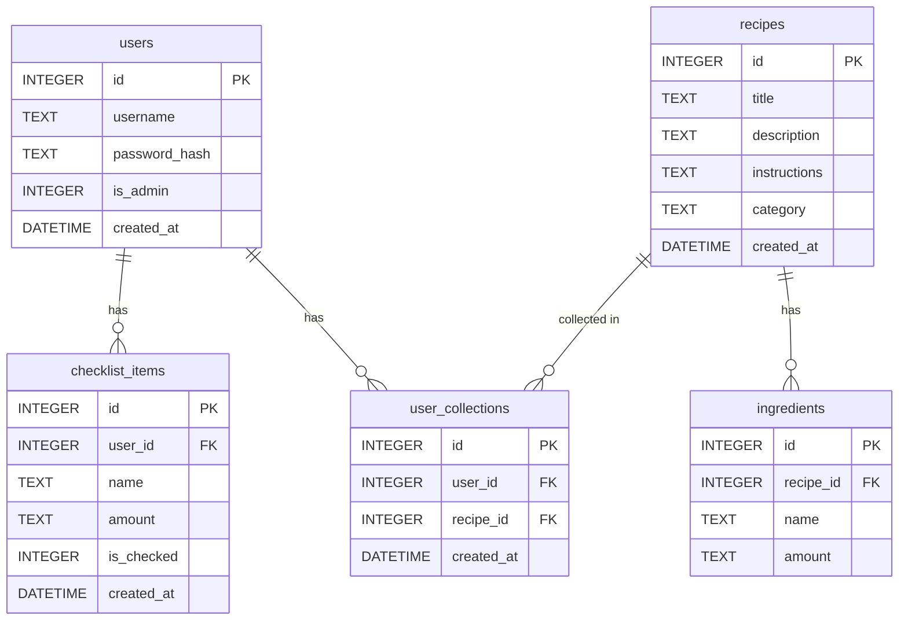

# 資料庫設計文件 (DB_DESIGN)

本文件依據 PRD 與架構設計，定義系統所需的 SQLite 資料表結構與關聯。

## 1. ER 圖（實體關係圖）

## 2. 資料表詳細說明

### users (使用者表)
儲存使用者帳號與權限。
- `id` (INTEGER): Primary Key, 自動遞增。
- `username` (TEXT): 使用者名稱，唯一且必填。
- `password_hash` (TEXT): 密碼雜湊值，必填。
- `is_admin` (INTEGER): 是否為管理員，預設 0。
- `created_at` (DATETIME): 建立時間。

### recipes (食譜表)
儲存食譜的基本資訊與步驟。
- `id` (INTEGER): Primary Key, 自動遞增。
- `title` (TEXT): 食譜名稱，必填。
- `description` (TEXT): 食譜簡介。
- `instructions` (TEXT): 烹飪步驟。
- `category` (TEXT): 分類標籤 (如中式、甜點)。
- `created_at` (DATETIME): 建立時間。

### ingredients (食材表)
儲存每道食譜對應的食材與份量。
- `id` (INTEGER): Primary Key, 自動遞增。
- `recipe_id` (INTEGER): Foreign Key，對應 `recipes.id`，必填 (若 recipe 被刪除，則連帶刪除 CASCADE)。
- `name` (TEXT): 食材名稱，必填。
- `amount` (TEXT): 食材份量，必填。

### user_collections (使用者收藏表)
儲存使用者收藏的食譜紀錄 (多對多關聯)。
- `id` (INTEGER): Primary Key, 自動遞增。
- `user_id` (INTEGER): Foreign Key，對應 `users.id`，必填。
- `recipe_id` (INTEGER): Foreign Key，對應 `recipes.id`，必填。
- `created_at` (DATETIME): 收藏時間。

### checklist_items (食材準備清單表)
儲存使用者的採買核取清單。
- `id` (INTEGER): Primary Key, 自動遞增。
- `user_id` (INTEGER): Foreign Key，對應 `users.id`，必填。
- `name` (TEXT): 食材名稱，必填。
- `amount` (TEXT): 食材份量。
- `is_checked` (INTEGER): 是否已買/已準備，預設為 0 (未準備)。
- `created_at` (DATETIME): 加入清單時間。

## 3. SQL 建表語法
完整的 CREATE TABLE 語法已儲存於 `database/schema.sql`，支援建立所有資料表與 Foreign Key 關聯。

## 4. Python Model 程式碼
依據 `ARCHITECTURE.md` 的規劃，我們採用原生的 `sqlite3` 語法進行查詢與寫入。相關檔案位於 `app/models/`：
- `app/models/__init__.py`: 包含連線資料庫與建立 Foreign Key 支援的 Helper Function (`get_db`)。
- `app/models/user.py`: `User` 模型，處理使用者註冊、登入與查找。
- `app/models/recipe.py`: 包含 `Recipe`, `Ingredient`, `Collection`, 與 `Checklist` 模型，實作所有操作邏輯。
