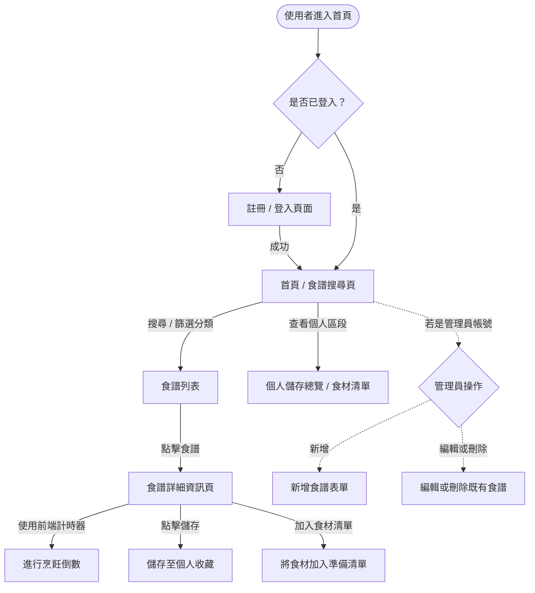
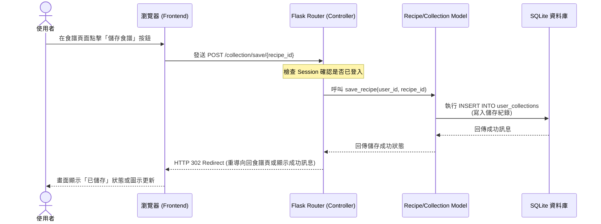

# 流程圖設計文件 (FLOWCHART)

這份文件根據 `docs/PRD.md` 與 `docs/ARCHITECTURE.md` 的規劃，詳細視覺化了「食譜收藏夾」網站的使用者操作路徑與系統資料流動，並列出各功能對應的路由規劃。

## 1. 使用者流程圖（User Flow）

以下流程圖說明了一般使用者與管理員進入網站後，可能經歷的各種操作情境與頁面跳轉：

## 2. 系統序列圖（Sequence Diagram）

以下示範本系統的核心互動：**「使用者將食譜加入個人收藏」** 的完整系統資料流。

## 3. 功能清單對照表

根據 PRD 定義的 MVP 範圍，本表格初步對應了每一個功能背後應具備的網址路徑 (URL) 以及 HTTP 方法。

| 功能類別 | 使用者故事 | URL 路徑 | HTTP 方法 | 模組 (Blueprint) |
|----------|------------|----------|-----------|------------------|
| **會員管理** | 註冊新帳號 | `/auth/register` | GET, POST | `auth.py` |
| **會員管理** | 登入帳號 | `/auth/login` | GET, POST | `auth.py` |
| **會員管理** | 登出帳號 | `/auth/logout` | POST | `auth.py` |
| **食譜瀏覽** | 首頁與關鍵字搜尋食譜 | `/` 或 `/recipes`| GET | `recipe.py` |
| **食譜瀏覽** | 檢視食譜完整圖文步驟 | `/recipe/<id>` | GET | `recipe.py` |
| **食譜庫管理** | 管理員新增食譜 | `/recipe/new` | GET, POST | `recipe.py` |
| **食譜庫管理** | 管理員編輯食譜 | `/recipe/<id>/edit` | GET, POST | `recipe.py` |
| **食譜庫管理** | 管理員刪除食譜 | `/recipe/<id>/delete`| POST | `recipe.py` |
| **食譜儲存** | 儲存/收藏特定食譜 | `/collection/save/<id>` | POST | `collection.py` |
| **食譜儲存** | 查看已儲存的個人清單 | `/collection` | GET | `collection.py` |
| **食材清單** | 將食材加入準備清單 | `/collection/checklist/add`| POST | `collection.py` |
| **食材清單** | 瀏覽與勾選準備狀態 | `/collection/checklist` | GET | `collection.py` |
| **計時功能** | 烹飪步驟計時倒數 | (無 - 純前端邏輯) | (無) | `static/js/main.js` |
